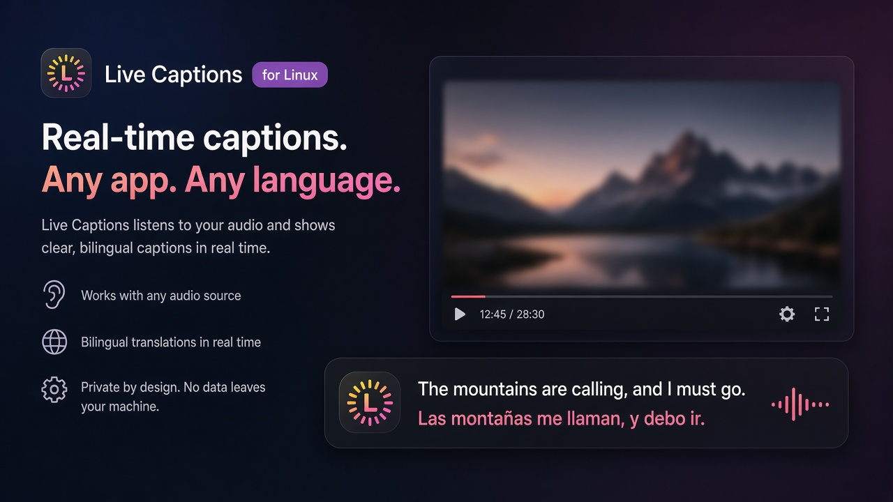
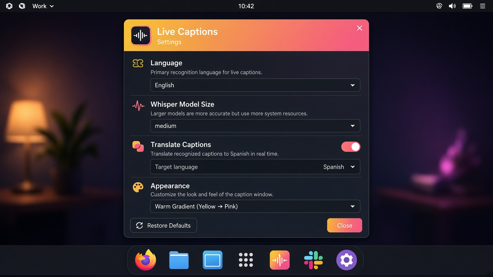

<div align="center">


# Live Captions

**Subtítulos en vivo para el audio de tu Linux — y traducción al instante, sin salir de tu máquina.**

Reproduce un vídeo, una llamada o un podcast. Los subtítulos aparecen encima de todo.
Si quieres, también en español.

<br>

[¡Empezar en 2 minutos!](#empezar) · [Cómo se ve](#cómo-se-ve) · [Qué hace](#qué-hace) · [Docs técnicos](TECHNICAL.md)

</div>

---

<p align="center">
  
</p>

## Cómo se ve

Overlay flotante sobre cualquier app, más un panel de ajustes claro:

<p align="center">
  
</p>

## Qué hace

| | |
|---|---|
| **Escucha el sistema** | Captura el audio que ya está saliendo por tus altavoces o auriculares (PipeWire / Pulse). No hace falta un micrófono. |
| **Subtítulos en vivo** | Transcripción incremental con Whisper en GPU NVIDIA. El texto se estabiliza mientras hablan. |
| **Traducción local** | Segunda línea en español, generada en tu PC. Nada se envía a la nube. |
| **Overlay siempre visible** | Ventana sin marco, arrastrable, encima del resto del escritorio. |

Pensado para series, chars, reuniones, streams y cualquier cosa que suene en el escritorio.

## Empezar

**Necesitas:** Ubuntu 24.04 (o similar) · Python 3.12 · GPU NVIDIA con CUDA · PipeWire o PulseAudio.

```bash
sudo apt install python3.12-venv pulseaudio-utils rsync

git clone https://github.com/pcgarat/live-captions-translate.git
cd live-captions-translate
make run
```

La primera vez prepara el entorno virtual y baja lo necesario. Cuando arranque:

1. Reproduce audio en cualquier app.
2. Abre ⚙, elige el monitor de salida (`*.monitor`) y el idioma de origen.
3. Activa la traducción si quieres la segunda línea en español.
4. Arrastra el overlay donde te resulte cómodo.

Instalación de usuario (lanzador en el menú):

```bash
make install-user
```

## Idiomas

Origen: inglés, español, francés, alemán, italiano, portugués, ruso, checo y polaco.  
Destino de traducción: español.

## Por qué es distinto

- **Todo local.** Audio, reconocimiento y traducción viven en un solo proceso Python. Sin servidor aparte, sin cuentas, sin telemetría de runtime.
- **El audio no toca el disco.** PCM en memoria; sin WAV temporales por chunk.
- **La UI no se atasca.** La inferencia corre fuera del hilo de Qt; el overlay solo pinta resultados listos.

## Stack

`Python 3.12` · `PyQt6` · `faster-whisper` · `CTranslate2` · Marian / Opus-MT · PipeWire / Pulse · NVIDIA CUDA

## Ir más lejos

El detalle de arquitectura, concurrencia, modelos, VRAM y operación está en **[TECHNICAL.md](TECHNICAL.md)**.

## Licencia

Consulta el repositorio para la licencia aplicable.
