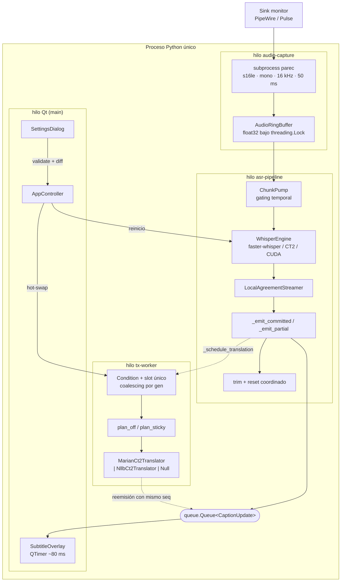
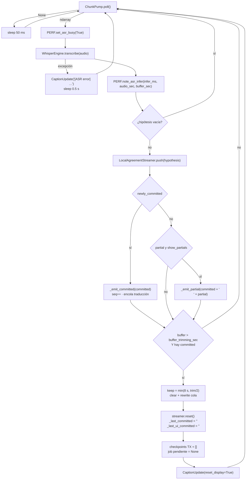
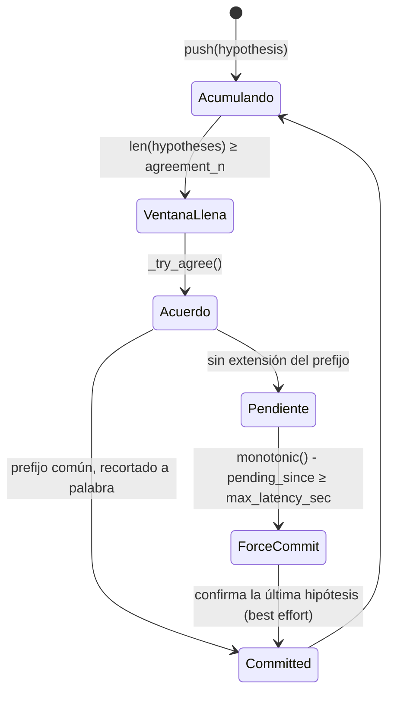
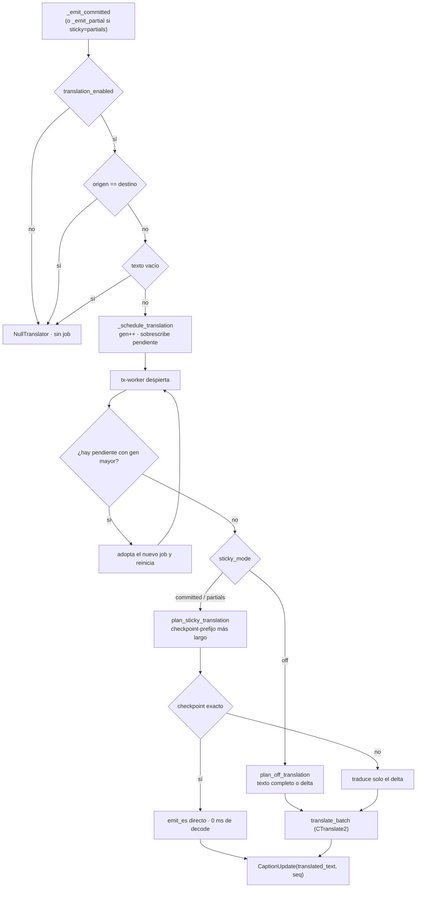
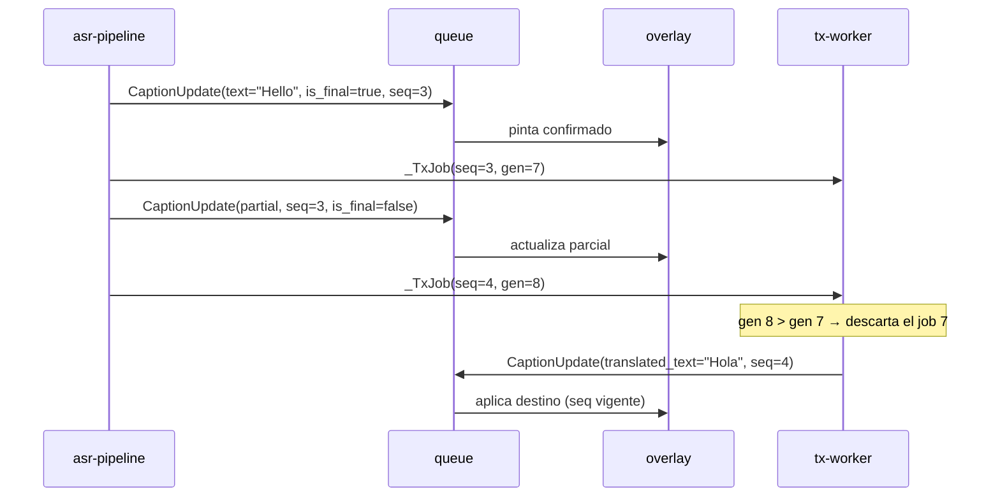

> **Documento técnico.** La guía de producto e instalación rápida está en [README.md](README.md).

<div align="center">


# Whisper Live Captions · Linux

**Motor de subtitulado en tiempo real sobre el bus de audio del sistema.**
Transcripción incremental con `faster-whisper` en CUDA, confirmación por acuerdo local de
hipótesis y traducción neuronal asíncrona. Todo in-process, todo local, cero red en runtime.

<sub>

`Python 3.12` · `PyQt6` · `faster-whisper` · `CTranslate2` · `Marian / Opus-MT` · `NLLB-200`
· `PipeWire / PulseAudio` · `NVIDIA CUDA` · `Ubuntu 24.04 / GNOME`

</sub>

</div>

---

## Índice

1. [Visión general e invariantes](#1-visión-general-e-invariantes)
2. [Modelo de concurrencia](#2-modelo-de-concurrencia)
3. [Ruta del audio](#3-ruta-del-audio)
4. [Motor de reconocimiento](#4-motor-de-reconocimiento)
5. [LocalAgreement: confirmación incremental](#5-localagreement-confirmación-incremental)
6. [Subsistema de traducción](#6-subsistema-de-traducción)
7. [Contrato de emisión y política de display](#7-contrato-de-emisión-y-política-de-display)
8. [Modelos, cuantización y presupuesto de VRAM](#8-modelos-cuantización-y-presupuesto-de-vram)
9. [Superficie de configuración](#9-superficie-de-configuración)
10. [Reconfiguración en caliente](#10-reconfiguración-en-caliente)
11. [Instalación y ejecución](#11-instalación-y-ejecución)
12. [Operación](#12-operación)
13. [Observabilidad](#13-observabilidad)
14. [Desarrollo y verificación](#14-desarrollo-y-verificación)
15. [Invariantes críticas y modos de fallo](#15-invariantes-críticas-y-modos-de-fallo)
16. [Alcance y licencias](#16-alcance-y-licencias)

---

## 1. Visión general e invariantes

Un único proceso Python captura el *monitor* de salida de PipeWire/PulseAudio, mantiene el
audio como PCM float32 mono a 16 kHz en memoria, lo somete a inferencias sucesivas de
Whisper sobre una **ventana creciente**, estabiliza el resultado con una política de
acuerdo local de hipótesis, y lo pinta en un overlay sin decoración que flota sobre el
resto del escritorio. La traducción es un subsistema desacoplado que nunca está en el
camino crítico del reconocimiento.

Invariantes que el sistema no viola:

| # | Invariante | Consecuencia de diseño |
| --- | --- | --- |
| I1 | Ninguna inferencia corre en el hilo de Qt | Toda comunicación cruza una `queue.Queue` drenada por timer |
| I2 | El audio nunca toca el disco | No hay WAV temporales por chunk; solo `ndarray` bajo lock |
| I3 | El idioma de origen lo fija el usuario | No hay auto-detect; `task` es siempre `transcribe` |
| I4 | El ASR nunca espera al traductor | El origen se pinta al instante; el destino llega después o se descarta |
| I5 | Un texto confirmado no se re-traduce entero | Reutilización de prefijos por checkpoints |
| I6 | El buffer de audio está acotado | Trim periódico con reseteo coordinado de streamer y estado de traducción |
| I7 | Sin `torch` ni `transformers` en el árbol de dependencias | Inferencia y conversión de modelos solo sobre CTranslate2 + numpy |

**Idiomas de origen:** inglés, español, francés, alemán, italiano, portugués, ruso, checo
y polaco. **Destino de traducción:** español.

---

## 2. Modelo de concurrencia

Cuatro hilos, un subproceso externo y una cola. La UI es un consumidor pasivo: no conoce
al pipeline, solo al contrato de mensajes.



| Hilo / proceso | Tipo | Responsabilidad | Bloqueo admitido |
| --- | --- | --- | --- |
| Qt main | proceso principal | Overlay, Settings, drenaje de la cola | Ninguno > 1 frame |
| `audio-capture` | `threading.Thread` daemon | Lee stdout de `parec` en bloques de 100 ms | I/O de pipe |
| `asr-pipeline` | `threading.Thread` daemon | Poll, inferencia, acuerdo, emisión, trim | Inferencia GPU |
| `tx-worker` | `threading.Thread` daemon | Planificación y decodificación de traducción | Decode CT2 |
| `parec` | `subprocess.Popen` | Único proceso externo del sistema | — |

### Primitivas de sincronización

| Primitiva | Protege | Nota |
| --- | --- | --- |
| `AudioRingBuffer._lock` | El `ndarray` compartido productor/consumidor | `read_all()` devuelve copia, no vista |
| `AsrPipeline._tx_lock` | Snapshot coherente de config de traducción | Evita leer un motor a medio recrear |
| `AsrPipeline._tx_pending_cv` | Slot de job pendiente + flag `_tx_busy` | `Condition` con espera de 200 ms |
| `LivePerfMetrics._lock` | Métricas vivas compartidas pipeline ↔ overlay | Sin I/O dentro del lock |
| `SessionTracer._lock` | Buffer de eventos y acumuladores estadísticos | Escritura a disco solo en `flush()` |

El apagado es cooperativo y ordenado: `stop()` señaliza el `Event`, cierra la captura
(`terminate` → `wait` → `kill`), hace `join` del hilo ASR con un timeout generoso (una
inferencia de Whisper puede superar los 3 s) y solo entonces drena y para el `tx-worker`.

---

## 3. Ruta del audio

### 3.1 Captura

`parec --format=s16le --channels=1 --rate=16000 --latency-msec=50 --raw` sobre el id de
fuente seleccionado. El hilo lector consume exactamente `sample_rate * 0.1 * 2` bytes por
iteración (100 ms de s16le mono) y convierte a float32 normalizado dividiendo por 32768.

El backend está detrás de tres `Protocol` (`AudioBackend`, `AudioStream`, `AudioSource`),
de modo que ni el pipeline ni la UI nombran nunca `pactl` ni `parec`. El contrato de
formato es explícito: **el stream escribe float32 mono a `sample_rate` en el buffer**; cómo
lo consigue es asunto del backend. No existe un remuestreador compartido porque ningún
backend actual lo necesita.

| Función del registro | Comportamiento |
| --- | --- |
| `available_backends()` | Backends cuyo `is_available()` devuelve verdadero |
| `resolve_backend(name=None)` | El pedido, o el primero disponible; `RuntimeError` accionable si no hay ninguno |
| `list_audio_sources()` | Fuentes del backend activo, priorizando `*.monitor` y marcando `is_loopback` |
| `describe(source_id)` | Describe un id persistido aunque el dispositivo ya no esté conectado |

### 3.2 Ring buffer y gating

`AudioRingBuffer` se dimensiona en `buffer_trimming_sec + 5` segundos y recorta por la
izquierda al escribir. `ChunkPump` aplica un doble gate antes de entregar audio:

```
poll():
  si  (monotonic() - last_emit) < min_chunk_seconds        → None
  si  buffer.size < sample_rate * min_chunk_seconds        → None
  en otro caso: devuelve el buffer ENTERO y marca last_emit
```

Esto no es una ventana deslizante clásica: cada entrega es un **prefijo acumulado** cada
vez más largo del audio reciente. Es lo que permite que Whisper reescriba su propia
hipótesis con más contexto, y también lo que hace que el coste por inferencia crezca
monótonamente hasta el trim.

---

## 4. Motor de reconocimiento

`WhisperEngine` envuelve `faster-whisper` (CTranslate2) con una configuración fija por
diseño:

| Parámetro | Valor | Razón |
| --- | --- | --- |
| `task` | `transcribe` | La traducción es un motor aparte, nunca `task=translate` |
| `language` | forzado desde config | Sin auto-detect: elimina saltos de idioma espurios |
| `condition_on_previous_text` | `True` | Coherencia entre inferencias de la ventana creciente |
| `without_timestamps` | `True` | No se consumen timestamps; ahorra decodificación |
| `vad_filter` | según `use_vad` | Filtrado de silencio delegado a faster-whisper |
| `beam_size` | 5 en `stable`, 1 en `low` | Derivado del modo de latencia, no configurable por separado |

### Ciclo del hilo ASR



El trim es el punto más delicado del pipeline: recorta el audio, resetea el streamer,
invalida el estado de traducción y avisa al overlay **en la misma sección crítica lógica**.
Si alguno de esos cuatro se desincronizara, el sistema emitiría deltas contra una base que
ya no existe.

---

## 5. LocalAgreement: confirmación incremental

La política de estabilización es propia. Confirma un prefijo cuando aparece idéntico en
`agreement_n` hipótesis consecutivas, y en ningún caso corta a mitad de palabra.



### Algoritmo

1. Normaliza la hipótesis (colapso de espacios) y la empuja a una ventana FIFO de tamaño
   `agreement_n`.
2. `_try_agree()`: prefijo común carácter a carácter de la ventana, pasado por
   `_safe_commit_prefix()`. Solo amplía `committed` si el candidato lo **extiende**.
3. `_safe_commit_prefix()`: si alguna hipótesis continúa el prefijo con un carácter
   alfanumérico pegado a otro alfanumérico, el corte cae dentro de una palabra; entonces
   retrocede al último espacio, y si no hay ninguno devuelve vacío.
4. `_maybe_force_commit()`: si no hubo acuerdo y existe un parcial pendiente desde hace
   más de `max_latency_sec`, confirma la última hipótesis. Emite delta si extiende el
   committed, o sustituye el committed completo si diverge.
5. `partial` = `latest[len(committed):]` cuando `latest` empieza por `committed`; si no
   (rewrite total), `partial` es la hipótesis entera.

### Traza de ejemplo con `agreement_n = 2`

| Paso | Hipótesis de Whisper | `committed` | `partial` | `newly_committed` |
| --- | --- | --- | --- | --- |
| 1 | `hello world` | — | `hello world` | — |
| 2 | `hello world today` | `hello world` | `today` | `hello world` |
| 3 | `hello world tonight` | `hello world` | `tonight` | — |
| 4 | *(sin acuerdo, 0.8 s después)* | `hello world tonight` | — | `tonight` |

### Compromisos

| Knob | Subirlo | Bajarlo |
| --- | --- | --- |
| `agreement_n` | Más estable, menos reescrituras, más latencia de confirmación | Confirma casi cualquier hipótesis: parpadeo |
| `max_latency_sec` | Menos commits prematuros, texto que se hace esperar | Techo de latencia duro, más correcciones visibles |
| `min_chunk_seconds` | Menos inferencias por segundo, menos carga GPU | Más refresco, RTF al límite |

> La palabra «SRA» no existe en este sistema: no hay clase, flag ni parámetro con ese
> nombre. El mecanismo es LocalAgreement y su umbral es `agreement_n`.

---

## 6. Subsistema de traducción

### 6.1 Topología

El productor (`asr-pipeline`) deposita un `_TxJob` en un **slot único** protegido por
`Condition`. No hay cola: un job nuevo sobrescribe al pendiente y el worker se queda
siempre con el de mayor `gen`. Ese es el mecanismo de *coalescing*, y es incondicional.



### 6.2 Planificadores

Funciones puras, sin estado ni I/O, cubiertas por tests sin GPU:

| Planificador | Entrada | Salida |
| --- | --- | --- |
| `plan_off_translation(last_src, text)` | Último origen traducido | Si `text` extiende a `last_src`, devuelve el delta con `append=True`; si no, el texto entero |
| `plan_sticky_translation(checkpoints, text)` | Lista de `TxCheckpoint(src, es)` | Busca el checkpoint más largo que sea prefijo de `text`. Coincidencia exacta → reemisión sin decodificar. Prefijo parcial → traduce solo el resto y concatena con `es_prefix` |

Un `TxCheckpoint` es un par (tramo de origen ya traducido, su traducción). Tras cada
emisión, `_advance_tx_state()` poda los checkpoints que han dejado de ser prefijo del
texto vigente e inserta el nuevo. Esto es lo que convierte una frase que crece palabra a
palabra en una secuencia de decodificaciones cortas en lugar de N traducciones completas.

### 6.3 Anti-starvation

El worker comprueba si hay un job más nuevo **antes** de planificar y **después** de
decodificar. Si aparece uno nuevo durante el decode, el resultado en curso se emite igual
y se avanza la base antes de adoptar el job nuevo: de lo contrario, con audio continuo la
línea traducida podría no actualizarse nunca.

### 6.4 Motores

| Aspecto | Detalle |
| --- | --- |
| Factory | `create_translator(config)` → `MarianCt2Translator` \| `NllbCt2Translator` \| `NullTranslator` |
| Identidad | `translator_fingerprint(config)`; incluye el idioma solo si el motor selecciona modelo por idioma |
| Cuantización | Marian `int8_float16`, NLLB `int8`; independientes del `compute_type` de Whisper |
| `max_decoding_length` | 96 (Marian) / 256 (NLLB) |
| Tokenización | `sentencepiece` para Marian (los `.spm` no traen `tokenizer.json`), `tokenizers` para NLLB |
| Degradación | Si CUDA falla al cargar, reintento en CPU y `notice` visible en el overlay |
| Precarga | Al arrancar y al recrear el motor, en un hilo `tx-preload` aparte |

Los errores de decodificación no se propagan: se registran y la línea traducida
simplemente no se actualiza. El subtítulo de origen nunca desaparece por un fallo del
traductor.

---

## 7. Contrato de emisión y política de display

### 7.1 `CaptionUpdate`

Dataclass inmutable; es la **única** superficie entre los hilos de cómputo y Qt.

```text
text                 texto ASR (parcial o confirmado)
is_final             False = partial; True = committed
language             idioma de origen configurado
ts_mono              reloj monotónico en el instante de emisión
translated_text      destino; None = no tocar la línea traducida
seq                  identificador monotónico por confirmación
translation_append   True = delta a concatenar, no reemplazo
notice               aviso operativo (p. ej. degradación a CPU)
reset_display        True tras trim de buffer o cambio de frase
```

### 7.2 Arbitraje por `seq`

La traducción viaja por detrás del original y se reemite con el `seq` de la frase a la que
pertenece. El overlay descarta cualquier traducción cuyo `seq` sea menor que el de la
frase en pantalla. El worker, además, eleva el `seq` al valor actual del contador cuando
el committed vivo sigue empezando por el texto traducido, para que una traducción válida
no quede huérfana tras un commit intermedio.



### 7.3 Compuertas de display

| Flag | Default | Efecto |
| --- | --- | --- |
| `captions_show_partials` | `false` | Si está desactivado no se emiten parciales **ni** se programa su traducción sticky |
| `captions_allow_rewrite` | `true` | Si está desactivado, solo se envía al overlay lo que extiende el último texto ya mostrado |
| `second_line_mode` | `none` | Con traducción activa: `live_asr` \| `original` \| `none` |

Tres estados internos que resuelven problemas distintos y no deben confundirse:

| Estado | Rol |
| --- | --- |
| `_last_committed` | Espejo del streamer; avanza aunque la UI no reciba nada |
| `_last_ui_committed` | Último texto realmente enviado al overlay; es la compuerta del rewrite |
| `_last_tx_committed` / `_tx_checkpoints` | Base de traducción en modo `off` y en modo sticky respectivamente |

Con traducción activa la línea 1 es el destino y la línea 2 depende de
`second_line_mode`. Nunca se pintan más de dos líneas de subtítulo.

---

## 8. Modelos, cuantización y presupuesto de VRAM

| Artefacto | Procedencia | Descarga | En disco | VRAM |
| --- | --- | --- | --- | --- |
| Whisper `large-v3-turbo` | `faster_whisper.download_model` | 1,6 GB | 1,6 GB | 992 MB en `int8_float16` |
| 5 × Opus-MT `tc-big` | ZIP Marian (Object Storage de CSC) → CT2 int8 | ~2,5 GB | ~685 MB | ~0,3 GB por modelo cargado |
| NLLB 600M / 1.3B *(opcional)* | `snapshot_download` de repos CT2 int8 | 647 MB / 1,4 GB | igual | ~1,1 / ~2,0 GB |

`large-v3-turbo` en `int8_float16` iguala en acierto a `medium` con la mitad de memoria y
menos latencia; `large-v3` completo no cabe junto al traductor en 8 GB con un navegador
reproduciendo vídeo.

### 8.1 Cadena de obtención de Opus-MT

Los modelos **no** vienen de Hugging Face. Se descargan como ZIP de Marian, se validan
contra `REQUIRED_FILES` (`model.bin`, `config.json`, `source.spm`, `target.spm`) y se
convierten a CT2 int8 con `ct2-opus-mt-converter`, que solo necesita numpy y pyyaml. La
conversión tarda ~90 s y por eso ocurre en la instalación, nunca con la ventana abierta.
El destino es `$XDG_DATA_HOME/whisper-live-captions/opus-mt`, redirigible con
`WLCL_MODELS_DIR`.

| Directorio CT2 | Cubre | Token de destino |
| --- | --- | --- |
| `tc-big-en-es` | inglés | — (bilingüe) |
| `tc-big-de-es` | alemán | — (bilingüe) |
| `tc-big-itc-itc` | francés, italiano, portugués | `>>spa<<` (multilingüe) |
| `tc-big-zle-es` | ruso | — (destino único) |
| `tc-big-sla-es` | checo, polaco | — (destino único) |

El registro es declarativo: añadir un idioma es añadir una fila. La caché se indexa por
nombre de modelo y no por idioma, porque fr/it/pt comparten directorio. El token de
destino solo se inyecta en los modelos multilingües: metérselo a un bilingüe degrada la
salida.

Se fijan las versiones `opusTCv20210807`. Los `*-bible-big-*` de 2024 puntúan algo mejor
en FLORES pero arrastran artefactos de corpus de diálogo
(*«Thank you very much.»* → *«Muchas gracias por tu comentario.»*).

### 8.2 Por qué Marian y no NLLB por defecto

En fragmentos cortos —el régimen dominante de un subtítulo— NLLB-200 alucina de forma
sistemática: `sì` → «¿Qué?», `yeah` → «- ¿Qué?», `espera` → «¿Qué quieres decir?».
Opus-MT sale limpio, ocupa ~0,3 GB de VRAM frente a ~2 GB y decodifica en 8 ms frente a 49
(medido en RTX 4060). NLLB-200 sigue seleccionable para idiomas sin modelo Marian, con la
limitación de licencia de la §16.

### 8.3 Precarga

```bash
make prefetch-models                          # descarga + conversión explícitas
./scripts/prefetch-models.py --list           # inventario de lo que bajaría, sin red
WLCL_SKIP_MODEL_PREFETCH=1 make install-user  # instalar sin descargar
```

La lista de modelos se **deriva del catálogo de presets**, no de una lista paralela que
pueda desincronizarse. Un fallo de red no aborta la instalación: se avisa y cada modelo se
descarga en su primer uso. Re-ejecutarlo con todo presente no transfiere nada.

---

## 9. Superficie de configuración

`DEFAULTS` se construye fusionando `config.example.json` sobre un diccionario embebido de
respaldo; la validación, los clamps y el espejado viven en `src/config.py`. Toda escritura
pasa por `validate_config`, así que un fichero editado a mano no puede dejar el sistema en
un estado imposible: los valores fuera de rango se recortan, no se rechazan.

### 9.1 Reconocimiento y audio

| Parámetro | Default | Dominio | Efecto |
| --- | --- | --- | --- |
| `language` | `en` | ISO de la lista instalada | Idioma Whisper **forzado** |
| `model` | `large-v3-turbo` | tamaños de faster-whisper | Modelo ASR |
| `device` | `cuda` | `cuda` \| `cpu` | Backend de inferencia |
| `compute_type` | `int8_float16` | `float16` \| `int8_float16` \| `int8` | Cuantización, solo Whisper |
| `audio_monitor` | `""` | id nativo de la fuente | Vacío → primer `*.monitor` disponible |
| `use_vad` | `true` | bool | `vad_filter` |
| `buffer_trimming_sec` | `15.0` | 5–60 s | Umbral de trim y, +5 s, tamaño del ring |

### 9.2 Latencia

El modo selecciona el perfil; los knobs efectivos viven en
`latency_profiles[latency_mode]`. Los campos homónimos de primer nivel se **espejan** al
validar y existen solo por compatibilidad: editarlos no tiene efecto si el perfil dice
otra cosa.

Hay dos conjuntos de valores que conviene no mezclar: el perfil que trae la configuración
distribuida y el de fábrica al que vuelve **Restablecer modo**.

| Modo | Config distribuida (`agreement_n` / `max_latency_sec` / `min_chunk_seconds`) | Fábrica (Restablecer modo) | `beam_size` Whisper |
| --- | --- | --- | --- |
| `stable` | 1 / 0.4 s / 0.8 s | 2 / 0.8 s / 0.8 s | 5 |
| `low` | 1 / 1.5 s / 0.35 s | 1 / 0.35 s / 0.35 s | 1 |

Clamps: `agreement_n` ∈ [1, 5], `max_latency_sec` ∈ [0.2, 3.0] s,
`min_chunk_seconds` ∈ [0.2, 5.0] s.

### 9.3 Traducción

| Parámetro | Default | Efecto |
| --- | --- | --- |
| `translation_enabled` | `true` | Instancia motor real o `NullTranslator` |
| `translation_target` | `es` | Idioma destino |
| `translation_sticky_mode` | `committed` | `off` \| `committed` \| `partials` |
| `translator_model` | `opus-mt-tc-big` | Motor, alias o repositorio CT2 arbitrario |
| `translation_decode_preset` | `balanced` | Perfil de decodificación activo |
| `translation_profiles` | fast / balanced / quality / custom | Knobs de decodificación |
| `installed_languages` | `en, es, fr, de, it, pt` | Idiomas del menú del overlay |
| `second_line_mode` | `none` | Composición de la segunda línea |
| `captions_show_partials` | `false` | Ver §7.3 |

| Perfil | `beam_size` | `length_penalty` | `no_repeat_ngram_size` |
| --- | --- | --- | --- |
| `fast` | 2 | 0.7 | 3 |
| `balanced` | 4 | 0.7 | 3 |
| `quality` | 6 | 0.7 | 3 |
| `custom` | editable (semilla: balanced) | editable | editable |

`beam_size` es lo único que distingue a los tres: es el knob de latencia.
`length_penalty` es 0.7 en todos porque con 1.0 el decodificador prefiere hipótesis largas
y rellena los fragmentos cortos (*«oui»* → *«Sí, sí.»*, *«então»* → *«Entonces...»*).
`no_repeat_ngram_size` 3 incluso en `fast`: cortar bucles de repetición no cuesta latencia
medible y es el peor fallo posible en pantalla.

Clamps: `beam_size` ∈ [1, 8], `length_penalty` ∈ [0.6, 1.5],
`no_repeat_ngram_size` ∈ [0, 5].

### 9.4 Presentación y geometría

| Parámetro | Default | Dominio |
| --- | --- | --- |
| `always_on_top` | `true` | Hint de ventana (fiable bajo xcb) |
| `font_family` | `""` | Catálogo curado por legibilidad sobre vídeo + familias de fontconfig, con el sufijo de fundición recortado |
| `font_size` | `26` | 10–100 |
| `font_weight` | `semibold` | `normal` (400) \| `semibold` (600) \| `bold` (700) |
| `font_color` / `bg_color` | `#ffffff` / `#000000` | Color de texto y panel |
| `bg_alpha` | `0.6` | 0.05–1.0 |
| `padding` | `20` | 0–100 px |
| `text_align` | `left` | `center` \| `left` |
| `window_*` | 900×170 | Ancho 300–2400, alto 120–1600 |
| `settings_window_*` | 858×920 | Ancho 520–2000, alto 640–1600 |
| `app_preset` / `app_presets` | `video-en-es` | Preset activo y mapa de snapshots |

La familia tipográfica se interpola en QSS, así que se sanea: máximo 64 caracteres y
prohibidos `"`, `'`, `;`, `{`, `}`, que podrían cerrar la declaración o el bloque.

> Claves `opt_*` heredadas (`opt_prefer_low_latency`, `opt_nllb_on_cpu`,
> `opt_tx_delta_only`, `opt_tx_coalesce_emit`, …) no están en `DEFAULTS` ni se leen en
> `src/`. Son residuo de experimentos. El coalescing del worker, por ejemplo, está siempre
> activo en el código y no depende de ninguna de ellas.

### 9.5 Presets generales

Dos semánticas distintas bajo el mismo selector:

| Tipo | Contenido | Al aplicarlo |
| --- | --- | --- |
| `default` | Snapshot **completo** de la configuración de referencia | Restaura también apariencia y geometría |
| `video-*` (9) | **Overrides** parciales: idioma + bloque de modelos + presentación | Hereda posición, tipografía, modo de latencia y dispositivo del usuario |
| Definidos por el usuario | Snapshot completo vía *Guardar como…* | Restauración total |

Los de fábrica no se pueden borrar, pero sí sobrescribir con **Guardar**. Cambiar el
selector aplica de inmediato y reinicia el ASR solo si el diff lo exige. Una configuración
preexistente no se pisa: los presets nuevos se añaden y los valores del usuario se
conservan.

---

## 10. Reconfiguración en caliente

El diálogo de preferencias no reinicia el proceso. Cada familia de cambios tiene su ruta:

| Cambio | Ruta | Coste |
| --- | --- | --- |
| `language`, `model`, `device`, `compute_type`, `use_vad`, `audio_monitor` | **Reinicio** del pipeline ASR | Recarga de modelo |
| `latency_mode` y perfiles | `apply_latency_settings` | Reajusta `agreement_n`, `max_latency_sec`, `min_chunk_seconds` y `beam_size` sobre las instancias vivas |
| Traducción (enable / target / sticky / preset / perfiles) | `apply_translation_settings` | Recrea el `Translator` **solo** si cambia el fingerprint |
| Presentación y apariencia | Aplicación directa en UI | Ninguno |

El fingerprint se calcula sobre la configuración fusionada *antes* de mutar el estado, de
modo que un cambio de preset de decodificación no tira el modelo cargado. Al cambiar de
modo sticky, y tras cada trim, arranque o parada, los checkpoints de traducción y el job
pendiente se invalidan.

---

## 11. Instalación y ejecución

### 11.1 Requisitos

| Componente | Requisito |
| --- | --- |
| Sistema | Ubuntu 24.04 o equivalente con GNOME |
| Python | 3.12 |
| GPU | NVIDIA con driver y CUDA operativos (validado en RTX 4060 8 GB) |
| Audio | PipeWire o PulseAudio con `pactl` y `parec` |
| Utilidades | `rsync` (solo para la instalación de usuario) |

```bash
sudo apt install python3.12-venv pulseaudio-utils rsync
```

Dependencias Python: `faster-whisper`, `PyQt6`, `numpy`, `huggingface_hub`, `tokenizers`,
`sentencepiece`. La ausencia de `torch` y `transformers` es deliberada y es una restricción
de diseño, no una casualidad.

### 11.2 Modo desarrollo

```bash
git clone https://github.com/pcgarat/live-captions-translate.git
cd live-captions-translate
make run
```

`make run` crea el `.venv`, instala dependencias, antepone las librerías Qt del venv en
`LD_LIBRARY_PATH`, fija `QT_PLUGIN_PATH` y fuerza `QT_QPA_PLATFORM=xcb`. Las tres cosas son
necesarias: bajo Wayland nativo el compositor ignora el z-order de Qt y el overlay se
hunde detrás de las ventanas, y mezclar el Qt del sistema con el de PyQt6 aborta el
arranque. La configuración se lee del directorio de trabajo.

### 11.3 Instalación de usuario

```bash
make install-user
```

| Artefacto | Ruta |
| --- | --- |
| Árbol de la app y su venv | `~/.local/share/whisper-live-captions/` |
| Lanzador (exporta `WLCL_APP_ROOT` y `WLCL_CONFIG_DIR`) | `~/.local/bin/whisper-live-captions` |
| Entrada de menú con `Exec` absoluto | `~/.local/share/applications/` |
| Iconos hicolor 32/48/64/128/256 + SVG escalable | `~/.local/share/icons/hicolor/` |
| Configuración XDG | `~/.config/whisper-live-captions/config.json` |
| Modelos Marian convertidos | `~/.local/share/whisper-live-captions/opus-mt/` |

`resolve_config_dir()` decide en runtime: si `WLCL_APP_ROOT` está definida, la config es
XDG; si no, es el `cwd`. Desarrollo y uso diario no comparten estado.

```bash
make uninstall-user                 # elimina app, lanzador e iconos; conserva la config
make uninstall-user PURGE_CONFIG=1  # elimina también la configuración XDG
```

### 11.4 Variables de entorno

| Variable | Efecto |
| --- | --- |
| `WLCL_APP_ROOT` | Raíz de la instalación; su presencia conmuta el modo XDG |
| `WLCL_CONFIG_DIR` | Directorio de configuración explícito |
| `WLCL_MODELS_DIR` | Raíz de los modelos Marian convertidos |
| `WLCL_INSTALL_ROOT` | Destino alternativo del instalador |
| `WLCL_SKIP_MODEL_PREFETCH` | Instala sin descargar modelos |
| `WLCL_DEBUG_HUD` | Fuerza el HUD sin tocar la configuración |
| `WLCL_DEBUG_TRACE` | Activa el trazador de sesión (e implica el HUD) |
| `WLCL_DEBUG_TRACE_PATH` | Ruta alternativa del volcado de trazas |

---

## 12. Operación

1. Reproduce audio en el equipo (navegador, reproductor, videollamada).
2. En **⚙**, selecciona el monitor de salida (`*.monitor`) y el idioma de origen.
3. Elige el modo de latencia: `stable` (confirmaciones más firmes) o `low` (respuesta más
   inmediata, más reescrituras visibles).
4. Activa el destino si quieres traducción y decide qué compone la segunda línea.
5. Coloca el overlay: arrastre por `startSystemMove()` con respaldo manual por offset, y
   la geometría se persiste con debounce.
6. **✕** cierra y detiene captura e inferencia de forma cooperativa.

Clic derecho sobre el overlay: menú propio (*Siempre encima*, ocultar, configuración, HUD
de depuración, cerrar). Clic sobre el código de idioma: ciclo entre los idiomas
instalados sin abrir preferencias. `make devices` enumera los monitores detectados desde
la terminal.

### Presets de vídeo

Nueve presets, uno por idioma de origen, todos con salida en español salvo el propio
español. Fijan `large-v3-turbo` en `int8_float16`, sticky `committed`, sin parciales y una
sola línea en pantalla.

| Preset | Origen | | Preset | Origen |
| --- | --- | --- | --- | --- |
| `video-en-es` | inglés | | `video-pt-es` | portugués |
| `video-fr-es` | francés | | `video-ru-es` | ruso |
| `video-de-es` | alemán | | `video-cs-es` | checo |
| `video-it-es` | italiano | | `video-pl-es` | polaco |
| `video-es` | español (solo transcribe) | | | |

`video-es` detecta que origen y destino coinciden y **no carga el traductor**. Los pares
en/de/fr/it/pt están medidos en RTX 4060; ru/cs/pl usan el mismo motor y catálogo sin
medición propia en ese hardware.

---

## 13. Observabilidad

### 13.1 HUD de métricas vivas

`LivePerfMetrics` es un singleton sin I/O compartido entre el pipeline y el overlay. El
chip que se pinta tiene este formato:

```
ASR 412ms rtf0.34 · q0 · buf9.4s · VRAM 2.1/8.0G
```

| Campo | Significado |
| --- | --- |
| `ASR …` / `ASR 412ms` | Inferencia en curso, o duración de la última |
| `rtf` | Real-time factor: segundos de cómputo por segundo de audio. Si supera 1.0 de forma sostenida, el sistema no sigue el ritmo |
| `q` | Profundidad de la cola de salida hacia la UI |
| `buf` | Segundos de audio acumulados en el ring |
| `VRAM` | Usada / total, leída por NVML vía `ctypes` sobre `libnvidia-ml.so.1` |

El acceso a NVML se carga de forma perezosa y se marca como fallido de forma permanente si
no está disponible, para no reintentar una carga de biblioteca en cada refresco del HUD.

### 13.2 Trazador de sesión

```bash
make debug   # HUD + volcado JSON al cerrar
```

Registra eventos tipados (`asr_infer`, `commit`, `partial`, `tx_schedule`, `tx_done`,
`tx_skip`, `buffer_trim`, `asr_error`, cambios de configuración) con un tope de 100 000
eventos y recortes de texto a 160 caracteres. El documento final incluye la configuración
inicial y la final, la lista de eventos y un resumen agregado:

| Métrica del resumen | Contenido |
| --- | --- |
| `asr_infer` | count, mean, p50, p95, max en ms |
| `asr_rtf` | count, mean, p50, p95, max |
| `tx_decode` | Tiempo de decodificación del traductor |
| `tx_lag` | Milisegundos entre el commit de un `seq` y la emisión de su traducción |
| `commits`, `partials`, `tx_emits`, `coalesce_skips`, `buffer_trims`, `asr_errors` | Contadores de la sesión |

`tx_lag` es la métrica que importa para diagnosticar el retraso percibido de la línea
traducida, y se correlaciona con los eventos por `seq` y `gen`. La escritura es atómica
(fichero temporal + `replace`).

---

## 14. Desarrollo y verificación

```bash
make help            # targets disponibles
make run             # ejecución con entorno Qt saneado
make debug           # HUD + trazador activos
make test            # pytest -q, plataforma offscreen, sin GPU
make lint            # ruff check
make format          # ruff check --fix + ruff format
make check           # test + lint
make devices         # enumera fuentes de audio del backend activo
make config-init     # materializa config.json desde el ejemplo
make prefetch-models # descarga y conversión de modelos
make clean           # elimina venv y cachés
```

La suite corre bajo `QT_QPA_PLATFORM=offscreen` y **no requiere GPU ni audio**. Cubre la
validación de configuración y sus clamps, el catálogo de presets, el algoritmo de
LocalAgreement, los planificadores de traducción como funciones puras, el parseo de
dispositivos con un backend falso que implementa el `Protocol`, la resolución de rutas de
empaquetado, el saneado de tipografías, el trazador y el comportamiento del overlay.

Los commits siguen Conventional Commits con el cuerpo en español.

### Verificación manual antes de publicar

- [ ] Arranque con GPU disponible y primera confirmación en menos de 3 s con vídeo real
- [ ] Sesión de ≥ 30 min sin degradación de UI ni crecimiento del ring
- [ ] Cambio de preset de vídeo sin mover ni redimensionar el overlay
- [ ] `video-es` transcribe sin instanciar traductor
- [ ] VRAM total por debajo de 8 GB con navegador reproduciendo (`nvidia-smi`)
- [ ] `rtf` p95 por debajo de 1.0 en el resumen de trazas
- [ ] Cierre limpio con persistencia de preferencias y geometría
- [ ] Tras instalar en `~/.local`, el primer arranque no descarga nada

---

## 15. Invariantes críticas y modos de fallo

1. **Hay dos `beam_size` y no son el mismo.** El de Whisper lo deriva `latency_mode`; el
   del traductor viene del perfil de decodificación. Tocar uno creyendo tocar el otro es el
   error de diagnóstico más frecuente.
2. **Whisper no traduce nunca.** `task` es siempre `transcribe`, incluso con origen y
   destino distintos. El español lo produce el motor de traducción, o es passthrough.
3. **Ventana creciente, no sliding window.** Cada inferencia ve casi todo el ring hasta el
   trim, de modo que el coste en GPU crece de forma monótona dentro de cada ciclo.
4. **Los knobs de latencia de primer nivel son espejos.** La fuente efectiva es el perfil
   del modo activo.
5. **El entorno Qt importa.** Arrancar siempre por `make run` o por el lanzador instalado;
   invocar el módulo a pelo puede mezclar el Qt del sistema con el del venv.
6. **Wayland nativo ignora el z-order.** Por eso el valor por defecto es xcb/XWayland. No
   se resuelve quitando xcb, se resolvería con layer-shell.
7. **Tras `setWindowFlags` hay que restaurar la posición**: el cambio de flags recrea la
   ventana nativa y el gestor de ventanas la recoloca.

| Síntoma | Causa habitual |
| --- | --- |
| No aparecen dispositivos de audio | Falta `pulseaudio-utils`; contrastar con `make devices` |
| El overlay se hunde tras otras ventanas | Sesión Wayland nativa; forzar `QT_QPA_PLATFORM=xcb` |
| Mensaje de degradación a CPU en pantalla | CUDA no cargó para el traductor: driver o `ctranslate2` incompatibles |
| `rtf` por encima de 1.0 sostenido | Modelo demasiado grande, `min_chunk_seconds` muy bajo o `buffer_trimming_sec` muy alto |
| Primer arranque muy lento | Descarga o conversión de modelos en caliente; ejecutar la precarga |
| La línea traducida se queda congelada | Origen y destino coinciden, o el motor falló y se registró el error sin romper el subtítulo |

---

## 16. Alcance y licencias

**Fuera de alcance por decisión explícita:** detección automática de idioma, servicios en
la nube, diarización de hablantes, backend TensorRT, extensión de navegador y garantía de
calidad para pares de idiomas distintos de los medidos.

| Componente | Licencia | Implicación |
| --- | --- | --- |
| Opus-MT `tc-big` | CC-BY-4.0 | Motor de traducción por defecto, sin restricción de uso |
| NLLB-200 distilled | CC-BY-**NC**-4.0 | Solo uso no comercial; es opcional y no se instala por defecto |
| Whisper (OpenAI) | MIT | Pesos servidos a través de faster-whisper |
